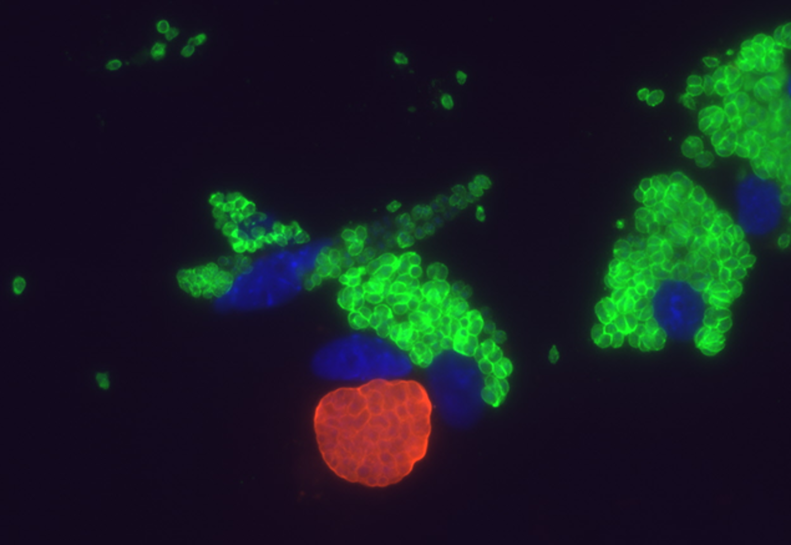

```{r setup, include=FALSE}
knitr::opts_chunk$set(echo = TRUE)
```



## About Me

I am a research associate at Sick Kids’ Centre for Advanced Single Cell Analysis. I perform and analyze mass cytometry experiments and manages the Core’s single-cell RNA-sequencing service. I got my PhD in Immunology from Cornell University and BSc in Microbiology and Immunology from The University of Western Ontario.


## Interests
* Single cell data analysis
* R
* Immunology
* Cats
* Cooking
* Gardening


## Profiles

* [LinkedIn](https://www.linkedin.com/in/deeqa-mahamed/)


## Contact

Email: deeqa.shire at gmail.com